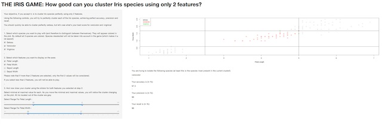

## IRIS CLUSTER GAME

The best R Game for Iris lovers and classification geeks

A Coursera "Developing Data Products" project

June 2014




---


## THE IRIS DATA SET

The famous Fisher's or Anderson's iris data set gives the measurements of 4 different features for 50 flowers from each of 3 species of iris (setosa, versicolor and virginica)

The data set is a data set with 150 cases (rows) and 5 variables (columns) named:

```
## [1] "Sepal.Length" "Sepal.Width"  "Petal.Length" "Petal.Width" 
## [5] "Species"
```

These data were collected in 1935 by Edgar Anderson and are used since this time to illustrate taxonomic and classification problems.


---
## THE GAME

The Iris Cluster Game is an interactive game using the Shiny R features to illustrate the fact that:
- one species is linearly separable from the other 2
- but the latter are NOT linearly separable from each other

On a 2 dimensional representation of the data set, the player will try to draw a cluster separating one species from the others.

Measurements of accuracy, precision and recall are computed automatically and displayed.


---
## HOW TO PLAY?

Controls are located on the left part of the screen and allow to:
- select species to play with
- choose the X and Y axis of the plot
- draw a cluster using sliders.

A plot of the 150 flowers of iris data set, colored by species, is shown on the right part of the screen. The cluster is dynamically displayed according to the sliders positions. 

Accuracy, precision and recall are computed and displayed, allowing the player to improve the clustering.

---
## HALL OF FAME

The setosa species is easily separable from other species, choosing correctly the adapted feature. The maximal petal length of setosa is smaller than the minimum of versicolor and virginica for the same feature.

```r
max(iris[iris$Species == "setosa", "Petal.Length"])
```

```
## [1] 1.9
```

```r
min(iris[iris$Species == "versicolor" | iris$Species == "virginica", 
         "Petal.Length"])
```

```
## [1] 3
```

After several minutes of playing, the player will be able to check that separating virginica or versicolor species is unfortunately not possible using a linear separation. 

